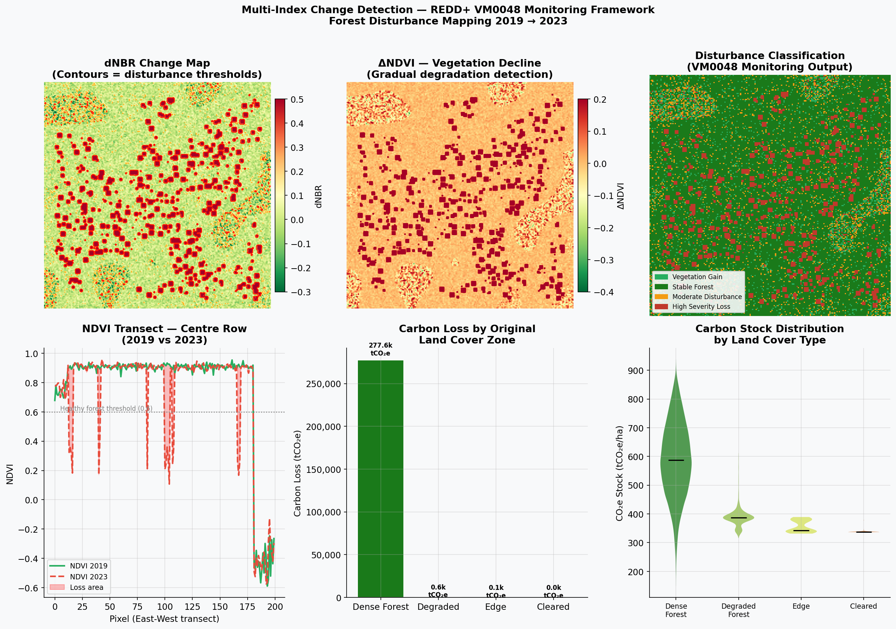

# Forest Carbon Estimation Using Remote Sensing

## Project Overview
This project estimates forest carbon stocks using Sentinel-2 satellite imagery and vegetation indices (NDVI).  
It also includes carbon credit estimation logic aligned with REDD+ methodology concepts.

## Objectives
- Calculate NDVI from Sentinel-2
- Estimate biomass and carbon stock
- Perform change detection
- Estimate potential carbon credits

## Tools Used
- Python
- Google Colab
- Raster processing
- Remote sensing analysis

## Sample Outputs

### Change Detection

## How to Run
1. Open the notebook in Google Colab
2. Run all cells
3. Outputs will be saved in the images/ and data/ folders

## Author
Timothy Okoliko  
Sustainability & Remote Sensing Analyst
